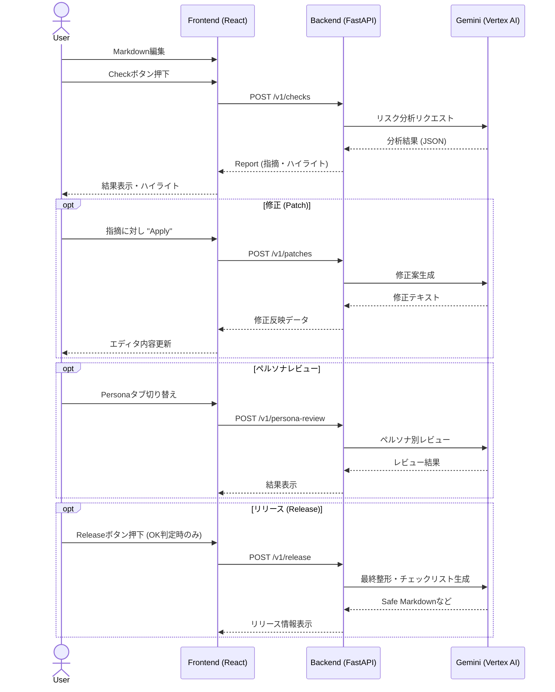

# Blog Risk Checker

このリポジトリは、第4回 Agentic AI Hackathon with Google Cloudで作成したアプリケーションです。

## 概要

Google Gemini 2.5 Flash を利用して、Markdown コンテンツのセキュリティ、プライバシー、法的リスクを分析します。

## アーキテクチャ

- **Frontend**: React 19 + TypeScript + Vite (ディレクトリ: `blog-risk-checker/`)
- **Backend**: FastAPI (Python) + Google Gemini API (ファイル: `main.py`)
- **State Management**: Zustand
- **Editor**: CodeMirror 6

## 動作環境・セットアップ

### 前提条件

- Node.js (Frontend用)
- Python 3.10+ (Backend用)
- Google Cloud Project (Vertex AI / Gemini API 利用可能)

### バックエンド (Backend)

1. 依存ライブラリのインストール
   ```bash
   pip install -r requirements.txt
   ```

2. 環境変数の設定 (`.env` ファイルまたはシェルで設定)
   ```bash
   export GOOGLE_CLOUD_PROJECT="your-project-id"
   export GOOGLE_CLOUD_LOCATION="us-central1"
   # 必要に応じて
   export GEMINI_MODEL="gemini-2.5-flash"
   ```

3. サーバー起動
   ```bash
   uvicorn main:app --reload --port 8000
   ```
   APIサーバーが `http://localhost:8000` で起動します。

### フロントエンド (Frontend)

1. ディレクトリ移動
   ```bash
   cd blog-risk-checker
   ```

2. 依存パッケージのインストール
   ```bash
   npm install
   ```

3. 開発サーバー起動
   ```bash
   npm run dev
   ```
   ブラウザで `http://localhost:5173` (Viteのデフォルト) にアクセスします。
   API接続先はデフォルトで `http://localhost:8000` です（`VITE_API_BASE_URL` で変更可能）。

## 主な機能と仕様

### 1. リスクチェック (Check)

- **機能**: エディタに入力された Markdown テキストを解析し、リスク（Findings）を検出します。
- **判定**: Verdict (OK, Warn, Bad) と Score (0-100) で評価されます。
- **指摘 (Finding)**: Categories (Privacy, Security 等) と Severity (Critical, High, Medium, Low) が付与されます。
- **ハイライト**: 指摘箇所はエディタ上で黄色くハイライト表示され、クリックで詳細を確認できます。

### 2. 修正パッチ (Patch / Fix)

- **機能**: 検出された指摘に対して、AI が修正案（Suggestion）を提示します。
- **適用**: 「Apply」ボタンを押すと、エディタ内の該当箇所が修正案に置換されます。その後、再チェック（Recheck）が推奨されます。

### 3. Audienceレビュー (Audience Review)

- **機能**: 設定した「想定読者 (Audience)」の視点で記事をレビューします。
- **UIタブ名**: 「Audience」（内部では `persona` として処理）
- **視点**:
  - `技術者 (Engineers)`: 技術的な正確性
  - `一般 (General)`: 分かりやすさ
  - `ビジネス (Executives)`: ビジネス価値
  - `コンプライアンス (Internal)`: 社内ルール適合性

### 4. リリース / エクスポート (Release / Export)

- **機能**: リスクスコアが `70` 以上の場合のみ実行可能です。
- **出力**: 安全化された Markdown、修正サマリ、公開前チェックリストが出力されます。
- **Exportメニュー**:
  - Copy Markdown: 安全化されたMarkdownをクリップボードにコピー
  - Download Markdown: `.md` ファイルとしてダウンロード
  - Copy Checklist: 公開前チェックリストをコピー
- **通知**: コピー成功時にトースト通知を表示（2秒で自動消去）

### 5. プレビュー (Preview)

- **機能**: 編集中の Markdown テキストをレンダリング表示します。
- **操作**: 設定バーのボタンで「Editor」（編集）と「Preview」（閲覧）を切り替え可能です。
- **技術**: `react-markdown` + `@tailwindcss/typography` (GitHub Flavored Markdown 対応)

### 6. UI仕様 (UI Specs)

- **Toast通知**: クリップボードコピー成功時などに、画面下部に通知を表示します（2秒で自動消去）。
- **日本語ラベル**: Public/Private などの設定値は、UI上では「公開」「非公開」などの日本語ラベルで表示されます。
- **タブ名称**: 右ペインのタブは「Findings」と「Audience」と表示されます（内部IDは `persona` を維持）。

## 処理フロー (シーケンス図)

